# User Manual

## Table of contents

- [User Manual](#user-manual)
  - [Table of contents](#table-of-contents)
  - [Introduction](#introduction)
  - [Features](#features)
  - [Getting Started](#getting-started)
  - [Create Configuration](#create-configuration)
  - [Exporting to CSV](#exporting-to-csv)
  - [Importing from CSV](#importing-from-csv)
  - [Modify / Add / Remove Subtasks from the current configuration already created](#modify--add--remove-subtasks-from-the-current-configuration-already-created)
  - [Pausing / Resuming / Advancing / Extending](#pausing--resuming--advancing--extending)
    - [Pause](#pause)
    - [Resume](#resume)
    - [Advance](#advance)
    - [Extend](#extend)
  - [Added feature: Sound](#added-feature-sound)
  - [Added feature: Calendar](#added-feature-calendar)
  - [Added feature: Create and Join Meeting](#added-feature-create-and-join-meeting)

## Introduction

To run our Timer application, simply run the TimerManager.py file with Python. This can be done by simply running it in an advanced text editor such as Visual Studio Code (though this method prevents the Sound feature from working), or by running it from the command line with the command `python -m TimerManager` in Windows, or `python3 TimerManager` in Mac, with the terminal pointing to the application directory.

Our countdown timer has the three required functionalities as well as three additional extended functionalities.

## Features

1. Allow users to specify sub-tasks and time.
2. Allow users to export and import sub-task and time configuration as a CSV file.
3. Allow users to pause / advance / extend the current sub-task.
4. Allow users to Modify / Add / Remove Subtasks from the current configuration already created.
5. Allow users to enable and modify sound alerts.
6. Allow users to schedule a reminder in the calendar to notify the users in the future.

## Getting Started

1. Open the application.
2. Enter the selection from the main menu
3. Using number following the menu to make selection

## Create Configuration

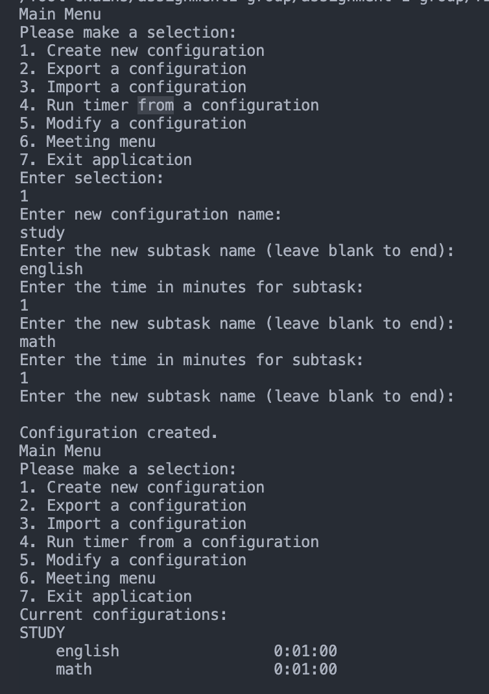

1. Open the application.
2. Enter Option "1" to create new configuration
3. First you can enter the configuration name
  E.g. "Study"
4. After the configuration is created, you can enter the number of sub-tasks
  E.g. "Math"
5. After the sub-task is created, you can enter how long the subtask should be. Integer is required
  E.g. "1". This stands for 1 minutes
6. After one sub-task is created, you can create another subtask if you would like.
7. In this case, I will create another subtask name "English" for 2 minutes
8. As I no longer want to add any other subtask, press Enter to proceed.
9. Now a configuration with two subtasks have been created

## Exporting to CSV

1. A configuration must first be created using the steps described in [Create Configuration](#create-configuration)
2. On the Main Menu screen, enter 2 to select the "Export a configuration" option
3. You will be prompted to enter the index of the configuration you want to export. This index begins at 0 and is based on the order that the configurations are listed to you at the Main Menu under "Current configurations:". In this example the configuration "STUDY" has an index of 0 and 'MEETING AGENDA' has an index of 1:
4. Entering 1 will create a file called 'Meeting Agenda.csv' containing the configuration information.

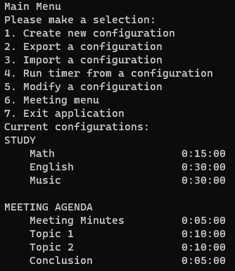

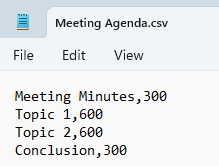

## Importing from CSV

If you close the program, created configurations are not remembered next time you launch. You can import a CSV file that was created using the export function above to save configurations between sessions.

1. On the Main Menu, enter 3 to select the "Import a configuration" option
2. You will be prompted to enter the name of the configuration you would like to import. This will be the name that was entered when creating the configuration initially (i.e. the csv file name without the file extension ".csv"). To import the "Meeting Configuration.csv" file we will enter "Meeting Agenda":
3. The imported configuration will join the list of current configurations and can now be treated like any other configuration

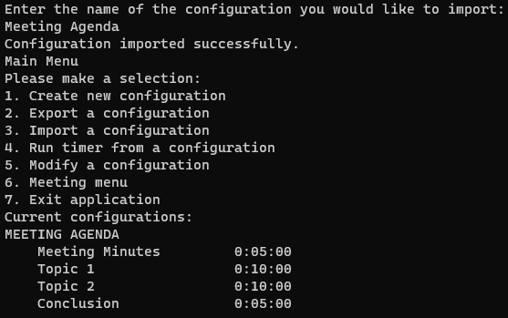

## Modify / Add / Remove Subtasks from the current configuration already created

1. Open the application.
2. Select option "5" after creating the configuration has been created previously.
3. Select the index of the configuration you want to modify (the first index starts from 0)
  E.g. "0" since I want to modify the first configuration
4. Now I will enter option "1" to modify the subtask name.
5. Now the subtask name has been changed to "english" to "literature"
6. I also want to change the subtask duration by pressing option "2"
7. The subtask duration has now been changed to 2 minutes
8. As I do not want any more changes, I press "3" to exit the subtask menu and go back to main menu
9. As you can see from this picture, the current configurations have now been changed with two subtasks:
  a.  Literature with 2 minutes duration
  b.  Math with 1 minute duration

## Pausing / Resuming / Advancing / Extending

1. Open the application.
2. Enter the option from the main menu
3. Specify the sub-tasks and time.
4. Start the timer.
5. Pause / resume / advance / extend the sub-tasks.

### Pause

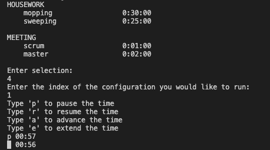

1. The timer is running
2. Type "p" and press ENTER key to pause the timer.
3. The timer pauses until any key interferes.

### Resume

1. The timer is paused,
2. Type "r" and press ENTER key to resume the timer.
3. The timer will go back to running mode.

### Advance

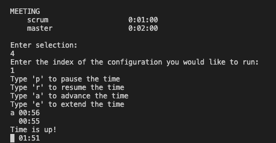

1. The timer is in any state (paused/running)
2. Type "a" and press ENTER key to advance the timer.
3. The timer will skip the task and go to the next task.

### Extend

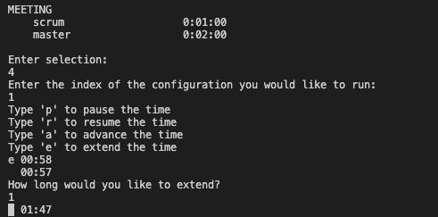

1. The timer is in any state (paused/running)
2. Type "e" and press ENTER key to extend the timer for a specific task.
3. Enter the extended time in minutes and press ENTER key
4. The timer will be added with additional time and run it until the time is up.

## Added feature: Sound

The option to have a sound play when a timer finishes has been added to the basic timer functionality. This is on by default, but can be turned off in the sound settings main menu selection. This functionality will only work if the program is launched from the terminal, it will not work if TimerManager is run in a code editor such as Visual Studio Code.

1. On the main menu selection, enter 7 to open the sound settings selection
2. Enter 1 to toggle the sound on or off

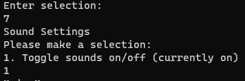

## Added feature: Calendar

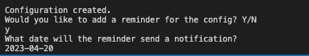

1. When configuration is created, enter "Y" or "N" for calendar reminder.
2. If "Y" is entered, the configuration is saved in the calendar.
3. If "N" is entered, the configuration is ignored by the calendar.
4. Enter the date the reminder will send the notification.
5. The calendar will prompt the users to do the configurations on the day.

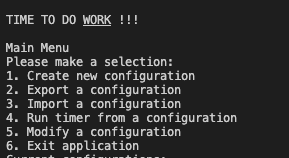

## Added feature: Create and Join Meeting

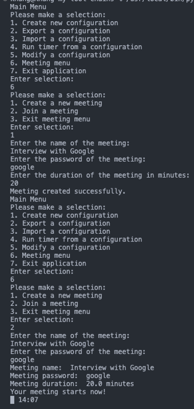

1. Select option "6" to enter Meeting menu.
2. Once you are in the Meeting menu, you can create a new meeting, join, or go back to the main menu
3. First, enter "1" to create a new meeting
4. Once the user inputs the name, password, and duration of meeting in minutes, the meeting is successfully created.
5. To join the created meeting, enter "2" in the meeting menu and enter the details of the created meeting.
6. Now you are in the meeting and timer will count down the time you have left for the meeting

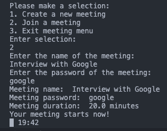
